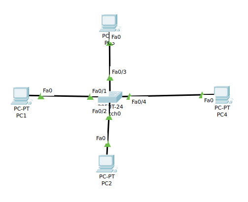
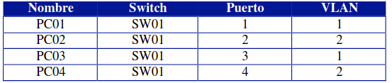
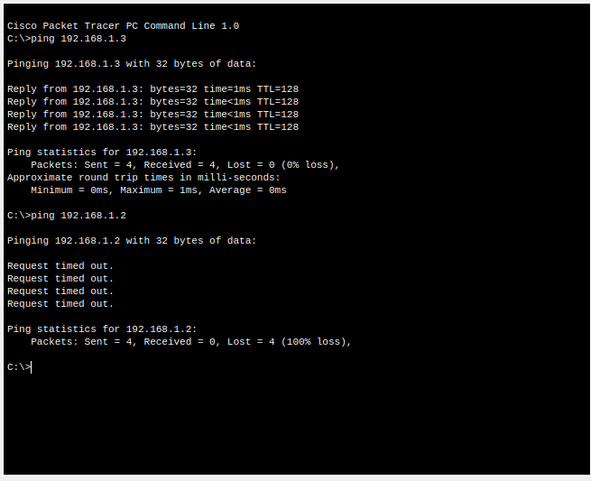
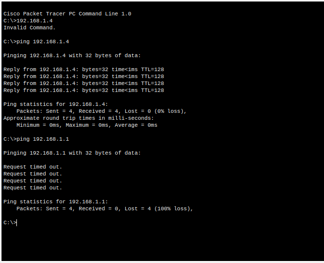
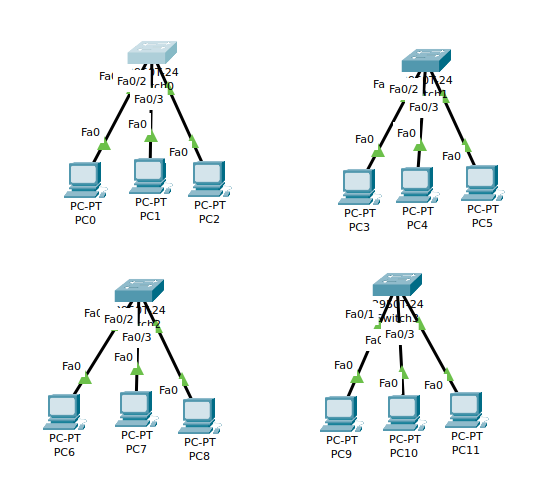
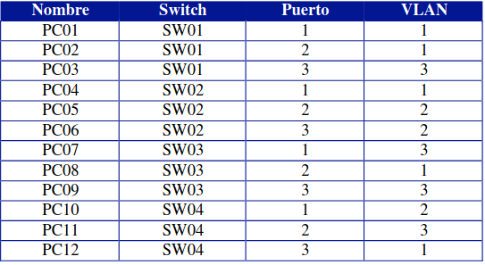
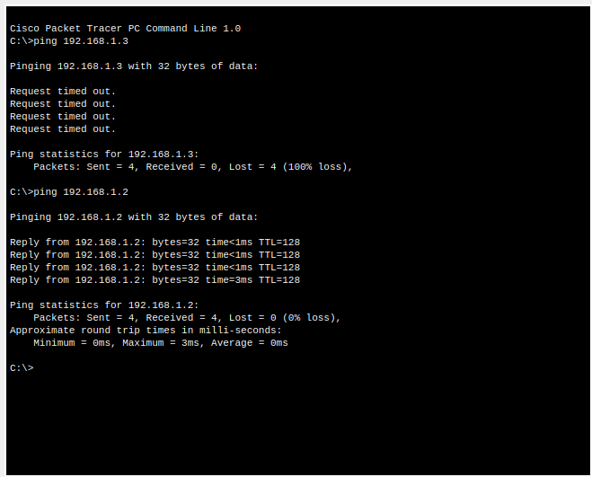
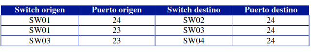
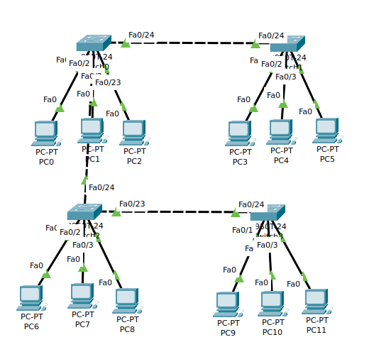

##Ejercicio 1

1. Diseño de la topologia



2.  Insertar 4 PC’s con la siguiente configuración:

Para enseñar las VLANS configuradas en el switch ponemos:

~~~
SW01(config)#hostname Jorge_sw
Jorge_sw(config)#exit
Jorge_sw#
%SYS-5-CONFIG_I: Configured from console by console
show vlan brief

VLAN Name                             Status    Ports
---- -------------------------------- --------- -------------------------------
1    default                          active    Fa0/1, Fa0/2, Fa0/3, Fa0/4
                                                Fa0/5, Fa0/6, Fa0/7, Fa0/8
                                                Fa0/9, Fa0/10, Fa0/11, Fa0/12
                                                Fa0/13, Fa0/14, Fa0/15, Fa0/16
                                                Fa0/17, Fa0/18, Fa0/19, Fa0/20
                                                Fa0/21, Fa0/22, Fa0/23, Fa0/24
                                                Gig0/1, Gig0/2
1002 fddi-default                     active    
1003 token-ring-default               active    
1004 fddinet-default                  active    
1005 trnet-default                    active    
~~~

3.  Insertar una nueva VLAN, que será la VLAN número 2, con el nombre PRUEBAV2.

~~~
Jorge_sw#config term
Enter configuration commands, one per line.  End with CNTL/Z.
Jorge_sw(config)#vlan 2
Jorge_sw(config-vlan)#name PruebaV2
Jorge_sw(config-vlan)#
~~~

Comprobamos que se a creado correctamente la vlan 2

~~~
Jorge_sw#show vlan brief

VLAN Name                             Status    Ports
---- -------------------------------- --------- -------------------------------
1    default                          active    Fa0/1, Fa0/2, Fa0/3, Fa0/4
                                                Fa0/5, Fa0/6, Fa0/7, Fa0/8
                                                Fa0/9, Fa0/10, Fa0/11, Fa0/12
                                                Fa0/13, Fa0/14, Fa0/15, Fa0/16
                                                Fa0/17, Fa0/18, Fa0/19, Fa0/20
                                                Fa0/21, Fa0/22, Fa0/23, Fa0/24
                                                Gig0/1, Gig0/2
2    PruebaV2                         active    
1002 fddi-default                     active    
1003 token-ring-default               active    
1004 fddinet-default                  active    
1005 trnet-default                    active    
~~~

4.  Realizar la siguiente configuración de redes VLAN:




Para ello ejecutamos:

~~~
Jorge_sw#config term
Jorge_sw(config)#interface fa
Jorge_sw(config)#interface fastEthernet 0/2
Jorge_sw(config-if)#switch
Jorge_sw(config-if)#switchport acce
Jorge_sw(config-if)#switchport access vlan 2

Jorge_sw#config ter
Jorge_sw#config terminal 
Enter configuration commands, one per line.  End with CNTL/Z.
Jorge_sw(config)#int
Jorge_sw(config)#interface fa0/4
Jorge_sw(config-if)#swi
Jorge_sw(config-if)#switchport acc
Jorge_sw(config-if)#switchport access vlan 2
Jorge_sw(config-if)#exit
~~~

Para comprobar que los puertos estan en las vlan hacemos el siguiente comando: 

~~~
show vlan brief

VLAN Name                             Status    Ports
---- -------------------------------- --------- -------------------------------
1    default                          active    Fa0/1, Fa0/3, Fa0/5, Fa0/6
                                                Fa0/7, Fa0/8, Fa0/9, Fa0/10
                                                Fa0/11, Fa0/12, Fa0/13, Fa0/14
                                                Fa0/15, Fa0/16, Fa0/17, Fa0/18
                                                Fa0/19, Fa0/20, Fa0/21, Fa0/22
                                                Fa0/23, Fa0/24, Gig0/1, Gig0/2
2    PruebaV2                         active    Fa0/2, Fa0/4
1002 fddi-default                     active    
1003 token-ring-default               active    
1004 fddinet-default                  active    
1005 trnet-default                    active    
~~~

5. Realizar ping entre los diferentes equipos para comprobar que la configuración anterior funciona correctamente.





##Ejercicio 2 

1. Montamos la topologia de red:



2. Insertar una nueva VLAN, que será la VLAN número 2, con el nombre
PRUEBAV2; VLAN número 3, con el nombre PRUEBAV3.

~~~
jorge_sw1(config)#
jorge_sw1(config)#vlan 2
jorge_sw1(config-vlan)#name PruebaV2
jorge_sw1(config-vlan)#exit
jorge_sw1(config)#vlan 3
jorge_sw1(config-vlan)#name PruebaV3
jorge_sw1(config-vlan)#exit
jorge_sw1(config)#
~~~

3. Comprobamos que se han creado correctamente

~~~
show vlan brief

VLAN Name                             Status    Ports
---- -------------------------------- --------- -------------------------------
1    default                          active    Fa0/1, Fa0/2, Fa0/3, Fa0/4
                                                Fa0/5, Fa0/6, Fa0/7, Fa0/8
                                                Fa0/9, Fa0/10, Fa0/11, Fa0/12
                                                Fa0/13, Fa0/14, Fa0/15, Fa0/16
                                                Fa0/17, Fa0/18, Fa0/19, Fa0/20
                                                Fa0/21, Fa0/22, Fa0/23, Fa0/24
                                                Gig0/1, Gig0/2
2    PruebaV2                         active    
3    PruebaV3                         active    
1002 fddi-default                     active    
1003 token-ring-default               active    
1004 fddinet-default                  active    
1005 trnet-default                    active    
jorge_sw1#
~~~

4.  Realizar la siguiente configuración de redes VLAN:



~~~
jorge_sw1(config)#interface fa
jorge_sw1(config)#interface fastEthernet 0/1
jorge_sw1(config-if)#sw
jorge_sw1(config-if)#switchport ac
jorge_sw1(config-if)#switchport access vlan 1
jorge_sw1(config-if)#exit
jorge_sw1(config)#inte
jorge_sw1(config)#interface fa
jorge_sw1(config)#interface fastEthernet 0/3
jorge_sw1(config-if)#sw
jorge_sw1(config-if)#switchport acc
jorge_sw1(config-if)#switchport access vlan 3
~~~

Ponemos la siguiente linea para que se guarden los ajustes en los switches:

~~~
jorge_sw1#copy run
jorge_sw1#copy running-config stat
jorge_sw1#copy running-config sta
jorge_sw1#copy running-config startup-config 
Destination filename [startup-config]? 
Building configuration...
[OK]
~~~

5. Realizar ping entre los diferentes equipos para comprobar que la configuración de cada equipo funciona correctamente



6. Colocar los switches conectados entre si





7. Colocar la siguiente configuración de puertos TRUNK de VLAN.

~~~
jorge_sw1#config ter
Enter configuration commands, one per line.  End with CNTL/Z.
jorge_sw1(config)#inte
jorge_sw1(config)#interface fa
jorge_sw1(config)#interface fastEthernet 0/24
jorge_sw1(config-if)#sw
jorge_sw1(config-if)#switchport mode 
jorge_sw1(config-if)#switchport mode trunk
jorge_sw1(config-if)#switchport trunk allowed vlan 1,2

jorge_sw1(config-if)#exit
jorge_sw1(config)#in
jorge_sw1(config)#interface fa
jorge_sw1(config)#interface fastEthernet 0/23
jorge_sw1(config-if)#sw
jorge_sw1(config-if)#switchport mode 
jorge_sw1(config-if)#switchport mode trunk
jorge_sw1(config-if)#switchport trun
jorge_sw1(config-if)#switchport trunk allo
jorge_sw1(config-if)#switchport trunk allowed vlan 1,2
~~~

Para configurar un puerto como trunk en un switch en Packet Tracer mediante la CLI, puedes usar los siguientes comandos:


1.  Entra en modo de configuración global:


```
switch# configure terminal
```

2.  Configura el modo de puerto para el puerto específico que deseas usar como trunk:


```
switch(config)# interface interface_number
```

3.  Configura el modo de puerto para trunk:


```
switch(config-if)# switchport mode trunk
```

4.  Configura los protocolos de VLAN permitidos en el trunk (opcional):


```
switch(config-if)# switchport trunk allowed vlan vlan_list
```

5.  Verifica la configuración:


```
switch(config-if)# end
switch# show interfaces interface_number switchport
```

Nota: Reemplaza "interface\_number" y "vlan\_list" con los valores apropiados para tu entorno.

2 / 2