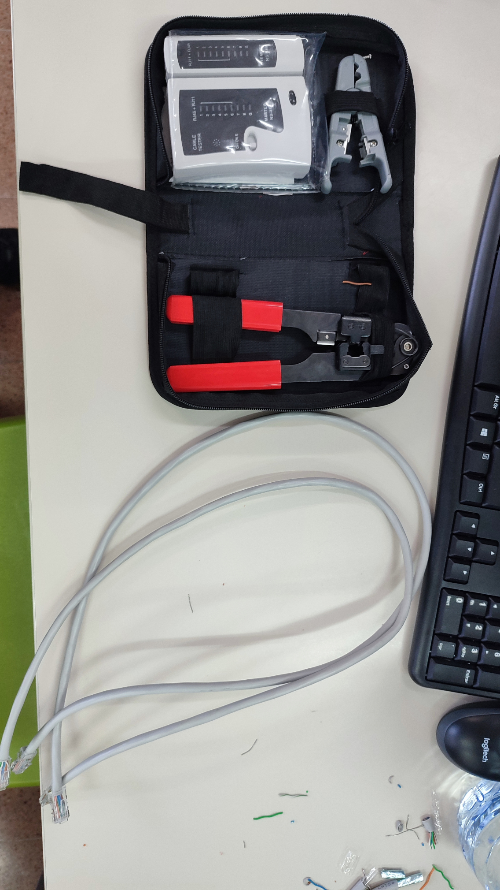

# TÍTULO DE LA PRÁCTICA

***Nombre:Jorge Francisco, Jose Carballeda***
***Curso:*** 1º de Ciclo Superior de Administración de Sistemas Informáticos en Red.

### ÍNDICE

+ [Introducción](#id1)
+ [Objetivos](#id2)
+ [Material empleado](#id3)
+ [Desarrollo](#id4)
+ [Conclusiones](#id5)

#### ***Introducción***. 

Vamos a relizar la practica de creacion de cables en clase:

-Cable par Cruzado. 
 
-Cable Directo.
 
-Cable Hembra.
 

#### ***Objetivos***. 

Realizar Cables RJ45 y comprobarlos en los testers para su correcto funcionamiento.
Realizar el Cable hembra y comprobarlo con el cable directo.

#### ***Material empleado***. 

Hemos usado como material:

-Crimpadora 
 
-Pela-Cables
 
-Tester
 
-Tijeras

 

#### ***Desarrollo***. 

Empezamos cortando y pelando el cable para despues estirarlos y enderezarlos separando los pares entre si  En esta parte tuvimos varios problemas empezando por que a la hora de los cables son muy sensibles y de vez en cuando se partian, por lo tanto teniamos que tener extremo cuidado, una vez enderezados procedimos a ordenalos para posteriormente introducirlos dentro del RJ45.

 

 

No obstante ordenar los cables era facil pero mantener el orden dentro del conector fue la parte mas complicada de todo el proceso, ya que apesar de ordenarlos en orden una vez empujamos hacia dentro el cable, se desordenaban o simplemente estaban muy separados y no entraban dentro del conector o los cables a la hora de ordenarlos se partian o se doblaban a la hora de introducirse.
Una vez introducimos el cable correctamente ordenado hasta el final del conector procedemos a crimparlos con la crimpadora, es decir hacer contacto el cable con los conectores.

 

Con el Cable directo el proceso es exactamente igual a diferencia del trenzado simplemente era el orden del color del cable.

 

Con el cable hembra fue bastante mas facil, simplemente pelamos el cable con una altura bastante pronunciada  Despues ordenamos los colores de el cable hembraen cada entrada del cable, y con la punchadora introducimos el cable dentro de la entrada del conector hembra despues de haber ordenado los cables simplemente cerrabamos el conector y listo ya teniamos el cable hembra hecho.                                                              

#### ***Conclusiones***. 

En conclusion hacer los pares de cables de internet ha sido realmente complejo solamente por meter los cables sin que se desordenaran en cambio el cable hembra fue bastante facil
