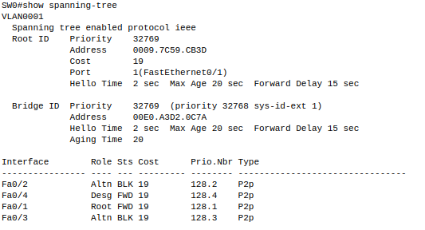
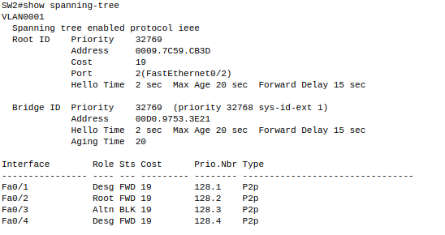
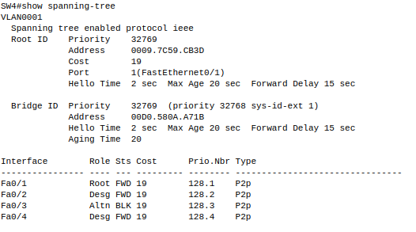
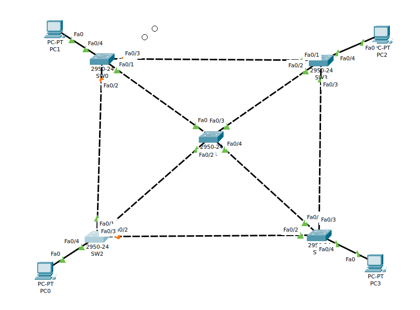
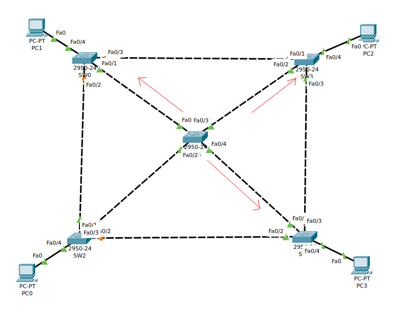
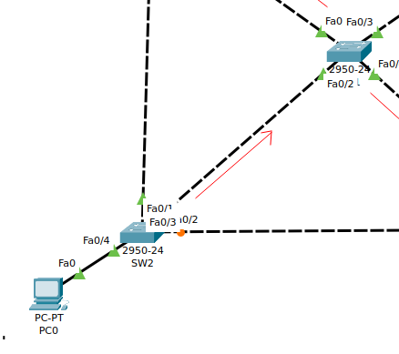
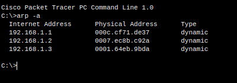
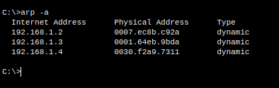
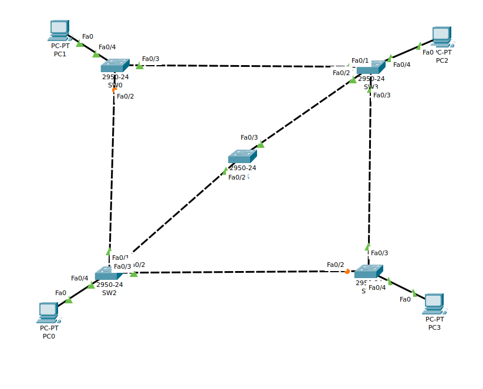

1. Identificar el puerto raiz

El SW1 es el puerto raiz

1.

2. Identificar los puertos no designados y en que switch se encuentran.

En el SW0 

En el SW2 

En el SW4

3. Comprobar que ya no existen bucles en nuestra red.

4. Comprobar que existe un camino único entre cada par de switches.

Entre SW3 y SW1

Entre SW2 Y SW1

4. Hacer pruebas de conectividad entre todos los equipos de la red.

PC0 

PC1

PC2

PC3

6. Eliminacion de los cables 

