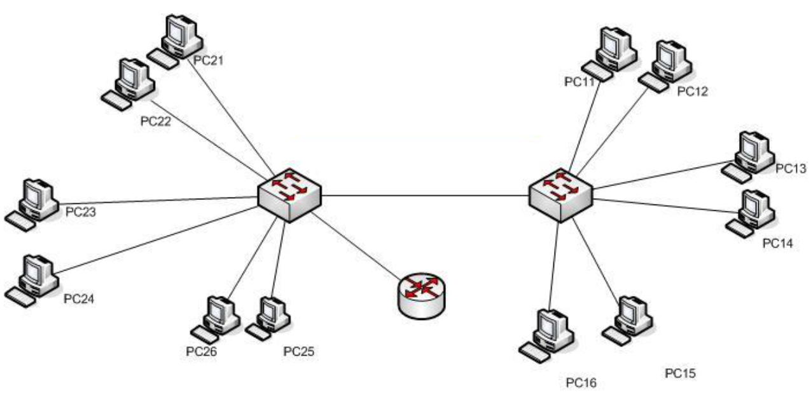

# CONFIGURACIÓN DE VLAN CON PUERTOS TRONCALES Y ENRUTAMIENTO (ROUTER ON A STICK)

Dado el esquema de red siguiente en el que tanto el cable entre los dos switches es un enlace troncal configurado para las `VLAN 10`, `VLAN 20` y `VLAN 30`. El cable que une el router al switch también es un enlace troncal configurado para las 3 VLANs.

Y con el direccionamiento `ip`  siguiente:

| HOST | DIRECCIÓN IP | VLAN | INTERFACE SW1 | INTERFACE SW2 |
| ---- | ------------ | ---- | ------------- | ------------- |
| PC11 | 10.10.0.11/24| 10   | -             | Fa0/2         |
| PC12 | 10.10.0.12/24| 10   | -             | Fa0/3         |
| PC13 | 10.20.0.13/24| 20   | -             | Fa0/4         |
| PC14 | 10.20.0.14/24| 20   | -             | Fa0/5         |
| PC15 | 10.30.0.15/24| 30   | -             | Fa0/6         |
| PC16 | 10.30.0.16/24| 30   | -             | Fa0/7         |
| PC21 | 10.10.0.21/24| 10   | Fa0/2         | -             |
| PC22 | 10.10.0.22/24| 10   | Fa0/3         | -             |
| PC23 | 10.20.0.23/24| 20   | Fa0/4         | -             |
| PC24 | 10.20.0.24/24| 20   | Fa0/5         | -             |
| PC25 | 10.30.0.25/24| 30   | Fa0/6         | -             |
| PC26 | 10.30.0.26/24| 30   | Fa0/7         | -              |

Los switches son del tipo ***Cisco 2950-24*** y están conectados entre si por medio un enlace troncal.

| SW1    | SW2    | VLAN | NOMBRE DE LA VLAN |
| ------ | ------ | ---- | ----------------- |
| Fa0/24 | Fa0/24 | 10   | VENTAS            |
| Fa0/23 | Fa0/23 | 20   | TALLER            |
| Fa0/22 | Fa0/22 | 30   | MARKETING         | 

El router `R1` es del tipo ***Cisco 2811*** y está conectado con el  switch  `SW1` por medio de un  enlace troncal  base a la tabla:

| SW1    | ROUTER | 
| ------ | ------ | 
| Fa0/21 | Fa0/1   | 
  

Responde a las siguientes preguntas:

1. Monta la topología en **Packet Tracer** y adjunta una imagen final

2. Confifura en cada switch las `VLAN`:

 + SW1 
~~~
Switch(config)#vlan 10
Switch(config-vlan)#name Ventas
Switch(config-vlan)#exit
Switch(config)#vlan 20
Switch(config-vlan)#name Taller
Switch(config-vlan)#vlan 30 
Switch(config-vlan)#name Marketing
~~~

 + SW12
~~~
Switch(config)#vlan 10 
Switch(config-vlan)#name Ventas
Switch(config-vlan)#vlan 20 
Switch(config-vlan)#name Taller
Switch(config-vlan)#vlan 30
Switch(config-vlan)#name Marketing
~~~

3. Configura cada uno de los puertos de los switches asignándolos a la `VLAN` que le corresponda, con la información que se da en las tablas del enunciado.

 + SW1 
~~~
Switch(config)#interface range fastEthernet 0/2-3
Switch(config-if-range)#switchport access vlan 10
Switch(config-if-range)#exit
Switch(config)#interface range fastEthernet 0/4-5
Switch(config-if-range)#switchport access vlan 20
Switch(config-if-range)#exit
Switch(config)#interface range fastEthernet 0/6-7
Switch(config-if-range)#switchport access vlan 30
Switch(config)#interface fa0/24
Switch(config-if)#switchport access vlan 10
Switch(config-if)#interface fa0/23
Switch(config-if)#switchport access vlan 20
Switch(config-if)#interface fa0/22
Switch(config-if)#switchport access vlan 30
~~~
+  SW2
~~~
Switch(config)#interface range fastEthernet 0/2-3
Switch(config-if-range)#switchport access vlan 10
Switch(config-if-range)#interface range fastEthernet 0/4-5
Switch(config-if-range)#switchport access vlan 20
Switch(config-if-range)#interface range fastEthernet 0/6-7
Switch(config-if-range)#switchport access vlan 30
Switch(config)#interface fa0/24
Switch(config-if)#switchport access vlan 10
Switch(config-if)#interface fa0/23
Switch(config-if)#switchport access vlan 20
Switch(config-if)#interface fa0/22
Switch(config-if)#switchport access vlan 30
~~~

4. Muestra un resumen de las `VLAN` configuradas en cada switch:

+ SW1 
~~~
show vlan brief

VLAN Name                             Status    Ports
---- -------------------------------- --------- -------------------------------
1    default                          active    Fa0/1, Fa0/8, Fa0/9, Fa0/10
                                                Fa0/11, Fa0/12, Fa0/13, Fa0/14
                                                Fa0/15, Fa0/16, Fa0/17, Fa0/18
                                                Fa0/19, Fa0/21
10   Ventas                           active    Fa0/2, Fa0/3, Fa0/24
20   Taller                           active    Fa0/4, Fa0/5, Fa0/23
30   Marketing                        active    Fa0/6, Fa0/7, Fa0/22
1002 fddi-default                     active    
1003 token-ring-default               active    
1004 fddinet-default                  active    
1005 trnet-default                    active    
~~~
+  SW2
~~~
SW2#show vlan brief

VLAN Name                             Status    Ports
---- -------------------------------- --------- -------------------------------
1    default                          active    Fa0/1, Fa0/8, Fa0/9, Fa0/10
                                                Fa0/11, Fa0/12, Fa0/13, Fa0/14
                                                Fa0/15, Fa0/16, Fa0/17, Fa0/18
                                                Fa0/19, Fa0/21
10   Ventas                           active    Fa0/2, Fa0/3, Fa0/24
20   Taller                           active    Fa0/4, Fa0/5, Fa0/23
30   Marketing                        active    Fa0/6, Fa0/7, Fa0/22
1002 fddi-default                     active    
1003 token-ring-default               active    
1004 fddinet-default                  active    
1005 trnet-default                    active    
~~~

5. Comprueba, mediante `PING`, que hay comunicación entre los equipos que pertenecen a una misma `VLAN` , y que no hay comunicación entre los equipos de distinta `VLAN`.

+ VLAN10
~~~

desde pc 22

C:\>ping 10.10.0.11

Pinging 10.10.0.11 with 32 bytes of data:

Reply from 10.10.0.11: bytes=32 time<1ms TTL=128
Reply from 10.10.0.11: bytes=32 time=1ms TTL=128
Reply from 10.10.0.11: bytes=32 time<1ms TTL=128
Reply from 10.10.0.11: bytes=32 time<1ms TTL=128

Ping statistics for 10.10.0.11:
    Packets: Sent = 4, Received = 4, Lost = 0 (0% loss),
Approximate round trip times in milli-seconds:
    Minimum = 0ms, Maximum = 1ms, Average = 0ms

~~~
+ VLAN20
~~~

C:\>ping 10.20.0.13

Pinging 10.20.0.13 with 32 bytes of data:

Reply from 10.20.0.13: bytes=32 time<1ms TTL=127
Reply from 10.20.0.13: bytes=32 time<1ms TTL=127
Reply from 10.20.0.13: bytes=32 time<1ms TTL=127
Reply from 10.20.0.13: bytes=32 time<1ms TTL=127

Ping statistics for 10.20.0.13:
    Packets: Sent = 4, Received = 4, Lost = 0 (0% loss),
Approximate round trip times in milli-seconds:
    Minimum = 0ms, Maximum = 0ms, Average = 0ms

~~~
+ VLAN30
~~~
C:\>ping 10.30.0.15

Pinging 10.30.0.15 with 32 bytes of data:

Request timed out.
Reply from 10.30.0.15: bytes=32 time<1ms TTL=127
Reply from 10.30.0.15: bytes=32 time<1ms TTL=127
Reply from 10.30.0.15: bytes=32 time<1ms TTL=127

Ping statistics for 10.30.0.15:
    Packets: Sent = 4, Received = 3, Lost = 1 (25% loss),
Approximate round trip times in milli-seconds:
    Minimum = 0ms, Maximum = 0ms, Average = 0ms
~~~

6. Conecta el cable del router `R1` configura la interfaz para `Fa0/1` para que por medio del protocolo `802.1Q` etiquete cada una de las `VLAN`. 

~~~
SW1(config)#interface fa0/21
SW1(config-if)#switchport mode trunk

Router(config)#interface fa0/1
Router(config-if)#in
Router(config-if)#interface fa0/0.10
Router(config-subif)#interface fa0/1.10
Router(config-subif)#en
Router(config-subif)#encapsulation d
Router(config-subif)#encapsulation dot1Q 10
Router(config-subif)#ip ad
Router(config-subif)#ip address 10.10.0.1 255.255.255.0
Router(config-subif)#interface fa0/1.20
Router(config-subif)#encapsulation dot1Q 20
Router(config-subif)#ip address 10.20.0.1 255.255.255.0
Router(config-subif)#interface fa0/1.30
Router(config-subif)#encapsulation dot1Q 30
Router(config-subif)#ip address 10.30.0.1 255.255.255.0
Router(config-subif)#exit
~~~

7. Comprueba, mediante `PING`, que hay comunicación entre los equipos que pertenecen a una misma `VLAN`

~~~

desde pc 22

C:\>ping 10.10.0.11

Pinging 10.10.0.11 with 32 bytes of data:

Reply from 10.10.0.11: bytes=32 time<1ms TTL=128
Reply from 10.10.0.11: bytes=32 time=1ms TTL=128
Reply from 10.10.0.11: bytes=32 time<1ms TTL=128
Reply from 10.10.0.11: bytes=32 time<1ms TTL=128

Ping statistics for 10.10.0.11:
    Packets: Sent = 4, Received = 4, Lost = 0 (0% loss),
Approximate round trip times in milli-seconds:
    Minimum = 0ms, Maximum = 1ms, Average = 0ms

C:\>ping 10.20.0.13

Pinging 10.20.0.13 with 32 bytes of data:

Reply from 10.20.0.13: bytes=32 time<1ms TTL=127
Reply from 10.20.0.13: bytes=32 time<1ms TTL=127
Reply from 10.20.0.13: bytes=32 time<1ms TTL=127
Reply from 10.20.0.13: bytes=32 time<1ms TTL=127

Ping statistics for 10.20.0.13:
    Packets: Sent = 4, Received = 4, Lost = 0 (0% loss),
Approximate round trip times in milli-seconds:
    Minimum = 0ms, Maximum = 0ms, Average = 0ms

C:\>ping 10.30.0.15

Pinging 10.30.0.15 with 32 bytes of data:

Request timed out.
Reply from 10.30.0.15: bytes=32 time<1ms TTL=127
Reply from 10.30.0.15: bytes=32 time<1ms TTL=127
Reply from 10.30.0.15: bytes=32 time<1ms TTL=127

Ping statistics for 10.30.0.15:
    Packets: Sent = 4, Received = 3, Lost = 1 (25% loss),
Approximate round trip times in milli-seconds:
    Minimum = 0ms, Maximum = 0ms, Average = 0ms
~~~