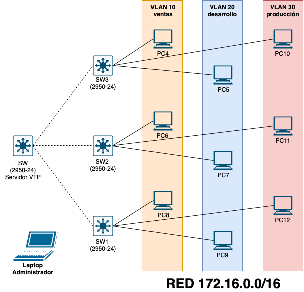
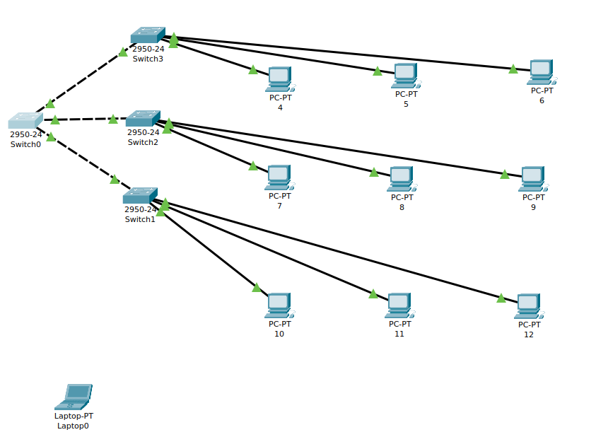

# CONFIGURACIÓN DE PARÁMETROS EN VLAN: VTP, VLAN DE ADMINISTRACIÓN Y SEGURIDAD DE PUERTOS

Dada la siguiente topología de red:

Y teniendo los requerimientos:

+ Direccionamiento `ip` de los equipos:

| HOST | IP          | VLAN |
| ---- | ----------- | ---- |
| PC4  | 172.16.0.4  | 10   |
| PC5  | 172.16.0.5  | 20   |
| PC6  | 172.16.0.6  | 10   |
| PC7  | 172.16.0.7  | 20   |
| PC8  | 172.16.0.8  | 10   |
| PC9  | 172.16.0.9  | 20   |
| PC10 | 172.16.0.10 | 30   |
| PC11 | 172.16.0.11 | 30   |
| PC12 | 172.16.0.12 | 30   | 

+ Los switches `SW1`, `SW1` y `SW3`  se conectan al principal `SW` por el ***puerto 24***.  Estos puertos serán ***troncales***.
+ El switch principal `SW` actuará como servidor `VTP`.  
+ Además de las `VLAN` que se ven en la figura se creará una `vlan 88` para los enlaces trunk que sera la ***vlan nativa***.  
+ Existirá una `vlan 99` de ***administración***.  
+ Cada switch tendrá una dirección `ip` para la administración en la red `192.168.0.0/24`  
+ El administrador de la red se conectará desde el ***puerto 20*** del `SW1` o desde el ***puerto 20*** del `SW2`. A esos puertos solo se podrá conectar el portátil del administrador. De lo contrario el  puerto se desactivará.  
+ En ninguno de los switches `SW1`, `SW2` y `SW3` se podrá conectar otro switch aparte del principal (servidor VTP).  
+ Los puertos que no estén en uso se desactivarán.  
+ Se activará una línea de `telnet` en cada switch para que el administrador pueda conectarse  en remoto. Contraseña 1234.

Resuelve las siguientes cuestiones:

1. Crea la topología usando ***Packet Tracer*** . Asigna las direciones `ip` a cada una de las máquinas. Inserta una imagen de la topología creada.

#### ***Configuración de VTP, VLAN y VLAN nativa***.

2. Configura el el dominio `VTP` con el nombre ***dominio_vtp*** y contraseña ***abcd***  en el switch principal `SW` . Crea las `VLAN` y configura los puertos que lo conectan con los otros switches en modo ***trunk*** con la `VLAN 88` como nativa. 

~~~
PEGA EL CÓDIGO AQUÍ
~~~

3. Muestra un resumen de las `VLAN` y los puertos ***trunk***  en el switch `SW`.

~~~
PEGA EL CÓDIGO AQUÍ
~~~

4. Configura los switches `SW1`, `SW2` y `SW3` como ***clientes*** `VTP` . Configura en cada uno de ellos el puerto 24 como nativo para la `VLAN 88`.

~~~
PEGA EL CÓDIGO AQUÍ
~~~

4. Muestra un resumen de las `VLAN` y los puertos troncales creados en `SW`.
 
+ Resumen de las `VLAN`:

~~~
PEGA EL CÓDIGO AQUÍ
~~~

+ Puertos troncales:

~~~
PEGA EL CÓDIGO AQUÍ
~~~

5. Configura los switches `SW1`, `SW2` y `SW3` como clientes `VTP`. Configura  en los switches `SW1`, `SW2` y `SW3` el puerto 24 como nativo para la `VLAN 88`.

+ SW1
~~~
PEGA EL CÓDIGO AQUÍ
~~~

+ SW2

~~~
PEGA EL CÓDIGO AQUÍ
~~~

+ SW3

~~~
PEGA EL CÓDIGO AQUÍ
~~~

6. Muestra un resumen las `VLAN` de `SW1`, `SW2` y `SW3` para comprobar que se han propagado las `VLAN` configuradas en el servidor.

+ SW1
~~~
PEGA EL CÓDIGO AQUÍ
~~~

+ SW2

~~~
PEGA EL CÓDIGO AQUÍ
~~~

+ SW3

~~~
PEGA EL CÓDIGO AQUÍ
~~~

#### ***Configuración de la VLAN de administración***.

7. Configura para cada switch la dirección `ip` para la administración en la red `192.168.0.0/24`, siguiendo el criterio:

| SWITCH | IP           | VLAN |
| ------ | ------------ | ---- |
| SW     | 192.168.0.10 | 99   |
| SW1    | 192.168.0.20 | 99   |
| SW2    | 192.168.0.30 | 99   |
| SW3    | 192.168.0.40 | 99   | 

+ SW

~~~
PEGA EL CÓDIGO AQUÍ
~~~

+ SW1
~~~
PEGA EL CÓDIGO AQUÍ
~~~

+ SW2

~~~
PEGA EL CÓDIGO AQUÍ
~~~

+ SW3

~~~
PEGA EL CÓDIGO AQUÍ
~~~

#### ***Configuración de la seguridad de puertos***.

6. Configura el ***puerto 20*** de `SW1` y  `SW2` de forma que sólo se podrán conectar a ellos  el portátil del administrador. De lo contrario el  puerto se desactivará. 

+ SW1
~~~
PEGA EL CÓDIGO AQUÍ
~~~

+ SW2

~~~
PEGA EL CÓDIGO AQUÍ
~~~

7. Desactiva en cada uno de los switches los puertos que no estén en uso.

+ SW

~~~
PEGA EL CÓDIGO AQUÍ
~~~

+ SW1
~~~
PEGA EL CÓDIGO AQUÍ
~~~

+ SW2

~~~
PEGA EL CÓDIGO AQUÍ
~~~

+ SW3

~~~
PEGA EL CÓDIGO AQUÍ
~~~

8. Habilita una línea `telnet` en cada switch para que el administrador pueda conectarse  en remoto. La contraseña es ***1234***.

+ SW

~~~
PEGA EL CÓDIGO AQUÍ
~~~

+ SW1
~~~
PEGA EL CÓDIGO AQUÍ
~~~

+ SW2

~~~
PEGA EL CÓDIGO AQUÍ
~~~

+ SW3

~~~
PEGA EL CÓDIGO AQUÍ
~~~
